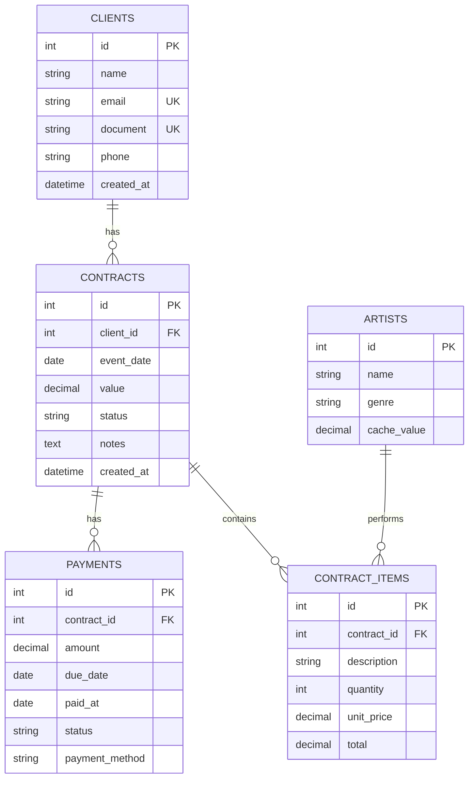
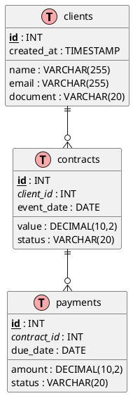
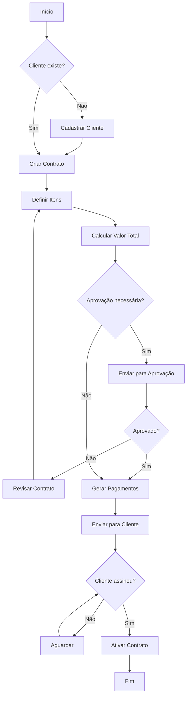
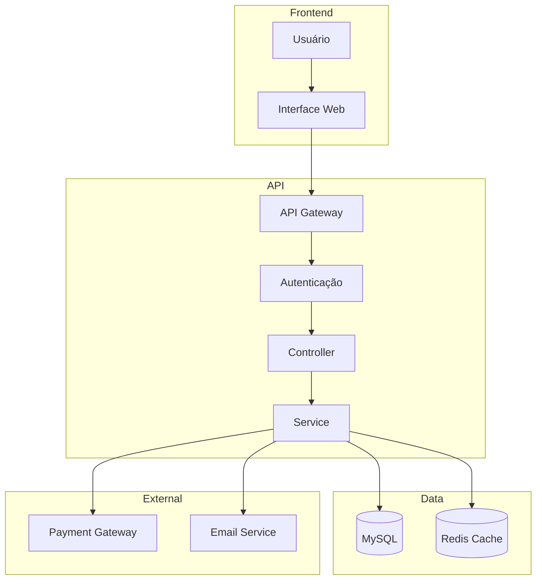
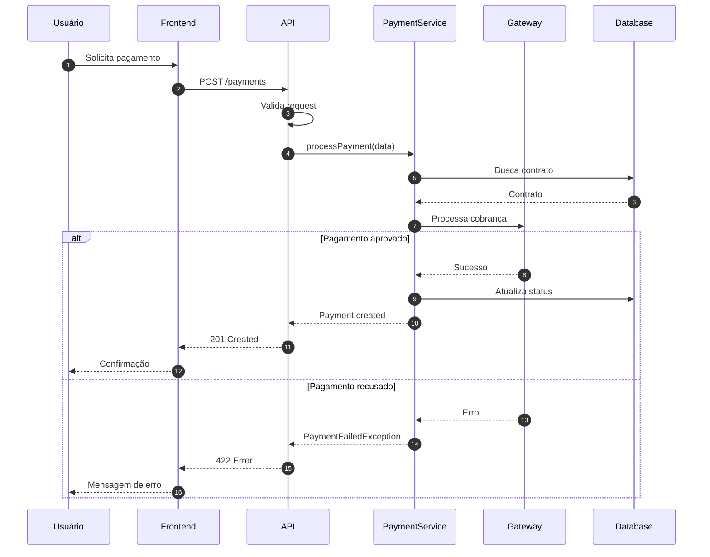
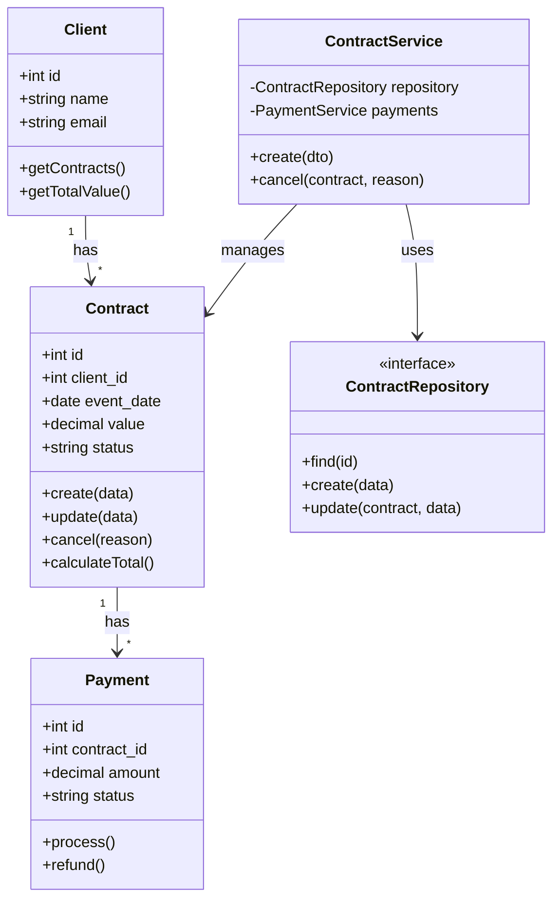
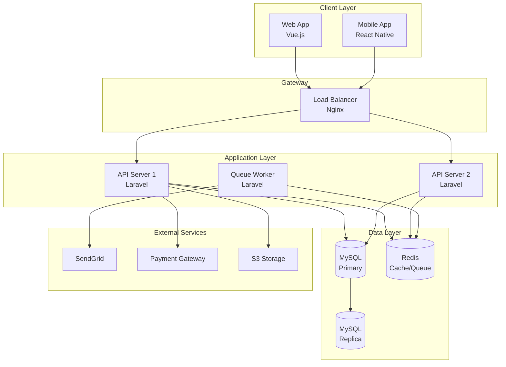
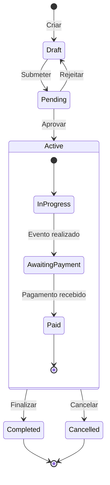
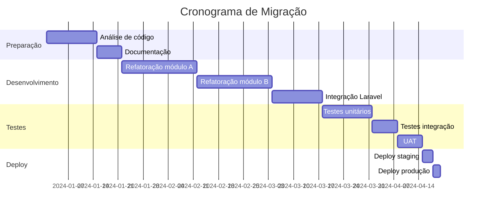

# Diagram Generator

Skill para criação de diagramas técnicos em Mermaid e PlantUML.

## Entity Relationship Diagram (ERD)

### Mermaid ERD



### PlantUML ERD



## Fluxogramas

### Processo de Contrato



### Fluxo com Subgrafos



## Diagrama de Sequência

### Fluxo de Pagamento



## Diagrama de Classes



## Diagrama de Arquitetura



## State Diagram



## Gantt Chart



## Dicas de Uso

```markdown
## Mermaid
- Suportado nativamente no GitHub, GitLab, Notion
- Usar para diagramas simples e médios
- Sintaxe mais limpa

## PlantUML
- Mais poderoso para diagramas complexos
- Requer servidor ou extensão
- Melhor para ERDs detalhados e UML completo

## Exportação
- Mermaid: mermaid.live
- PlantUML: plantuml.com/plantuml
```
